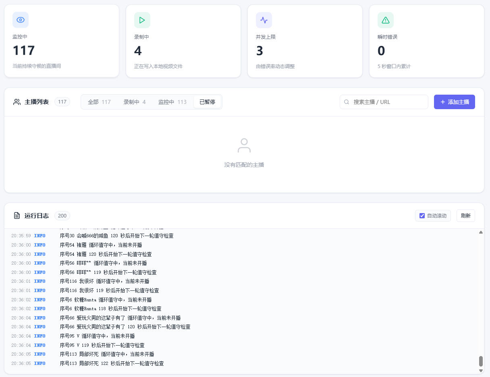

# DouyinLiveRecorder-UI

## 简介

`DouyinLiveRecorder-UI` 是一个面向抖音直播录制场景的轻量化值守工具，提供 Web UI 管理界面，方便统一维护录制任务、查看状态与日志。

项目基于 [ihmily/DouyinLiveRecorder](https://github.com/ihmily/DouyinLiveRecorder) 精简和改造，仅保留抖音直播录制相关能力，并补充了更直观的前端管理页面，适合长期挂机监控、录制和日常运维。



## 功能特点

- 仅聚焦抖音直播录制，减少无关功能干扰；
- 提供 Web UI，可直接管理主播列表、查看实时状态和运行日志；
- 基于 FFmpeg 录制直播流，输出稳定，可配合现有存储目录使用；
- 支持通过 `config.ini` 和 `URL_config.ini` 调整录制与轮询策略；
- 适合通过 `systemd` 长期托管运行。

## UI 界面说明

当前 Web UI 主要分为 3 个区域，适合日常值守时快速查看整体状态和处理异常：

### 1. 顶部状态概览

- `监控中`：显示当前正在持续守候的直播间数量；
- `录制中`：显示此刻正在写入本地视频文件的直播间数量；
- `并发上限`：显示当前允许同时录制的并发数，可由程序动态调整；
- `瞬时错误`：统计最近短时间窗口内累计的错误次数，便于快速判断当前是否存在异常波动。

### 2. 主播列表区

- 支持按 `全部`、`录制中`、`监控中`、`已暂停` 分类查看主播；
- 顶部带主播总数统计，方便快速了解任务规模；
- 右侧提供 `搜索主播 / URL` 输入框，可直接过滤目标主播；
- 支持 `添加主播` 按钮，直接在页面中补充新的监控对象；
- 当筛选结果为空时，会显示明显的空状态提示，避免误判为页面异常。

### 3. 运行日志区

- 底部 `运行日志` 面板用于实时查看后台处理情况；
- 日志按时间和级别展示，便于快速排查轮询、开播检测、录制启动等行为；
- 支持 `自动滚动` 开关，适合值守时持续追踪最新输出；
- 支持手动 `刷新`，在排查问题时可主动拉取最新状态。

## 项目结构

```
.
└── DouyinLiveRecorder/
    ├── /config -> (配置文件: config.ini + URL_config.ini)
    ├── /logs -> (运行日志)
    ├── /backup_config -> (配置定时备份)
    ├── /downloads -> (录制文件输出目录)
    ├── /src
    │   ├── runtime.py -> (跨线程共享状态、锁、常驻 asyncio 事件循环)
    │   ├── config_loader.py -> (config.ini 读取与热重载)
    │   ├── url_config.py -> (URL_config.ini 解析与 worker 调度)
    │   ├── recorder.py -> (单直播间录制 worker，封装 ffmpeg 子进程)
    │   ├── monitor.py -> (控制台状态打印 + max_request 动态调整)
    │   ├── file_ops.py -> (URL_config 行级改写 + 配置备份)
    │   ├── spider.py -> (抖音 Web/App 端直播数据抓取)
    │   ├── stream.py -> (从抓取结果提取流地址、画质映射)
    │   ├── room.py -> (URL 解析、x-bogus 签名)
    │   ├── ab_sign.py -> (a_bogus 签名: SM3 + RC4)
    │   ├── http_clients/ -> (httpx 异步封装)
    │   ├── utils.py / logger.py / proxy.py / initializer.py
    ├── /webui
    │   ├── server.py -> (FastAPI 后端，本机 127.0.0.1:8000)
    │   ├── /static
    │   │   └── index.html -> (Vue 3 单页面前端)
    ├── main.py -> (装配层: banner → ffmpeg → 主循环)
    ├── ffmpeg_install.py -> (Windows 自动安装 ffmpeg)
```

## 使用说明

### 直播间链接示例

```
https://live.douyin.com/745964462470
https://v.douyin.com/iQFeBnt/
https://live.douyin.com/yall1102  (链接+抖音号)
https://v.douyin.com/CeiU5cbX  (主播主页地址)
```

可通过 WebUI 或在 `config/URL_config.ini` 中手动添加直播间地址，一行一个。

如需自定义配置，可修改 `config/config.ini` 文件。

如果监控的主播很多，建议调大下面两个参数，避免程序刚启动时集中请求过多触发风控：

- `首次启动排队读取网址时间(秒)`：仅首次启动时，每个直播间 worker 拉起前的基础等待时间；
- `首次启动随机抖动时间(秒)`：在基础等待时间上再额外随机增加 `0~N` 秒，进一步打散请求节奏。

### 源码运行

1. 拉取项目代码

```bash
git clone https://github.com/as2931543asd/DouyinLiveRecorder-UI.git
cd DouyinLiveRecorder-UI
```

2. 安装依赖

```bash
# 使用 pip
pip3 install -U pip && pip3 install -r requirements.txt

# 或者使用 uv (推荐)
uv sync
```

3. 安装 FFmpeg

```bash
# macOS
brew install ffmpeg

# Ubuntu
apt update && apt install ffmpeg

# CentOS
yum install epel-release && yum install ffmpeg
```

Windows 系统可跳过此步，程序会自动处理。

4. 运行程序

```bash
python main.py
# 或
uv run main.py
```

5. 打开 WebUI

程序启动后访问 [http://localhost:9527](http://localhost:9527)，可在网页上：

- 查看顶部状态卡片，快速掌握监控数量、录制数量、并发上限和近期错误数；
- 在主播列表中按状态筛选任务，并通过搜索框定位指定主播或直播间 URL；
- 使用 `添加主播` 按钮补充新的监控对象；
- 在列表中管理主播任务，支持添加 / 暂停 / 恢复 / 删除主播；
- 底部"运行日志"面板可实时查看程序输出，并支持自动滚动与手动刷新。

### systemd 托管

当前项目实际运行时，推荐通过系统级服务 `douyinlive-status.service` 托管，而不是直接长期前台运行 `python main.py`。

如果你是通过该服务部署本项目，可使用下面这些命令：

```bash
# 查看状态
systemctl status douyinlive-status.service

# 重启服务
systemctl restart douyinlive-status.service

# 查看最近日志
journalctl -u douyinlive-status.service -n 100 --no-pager

# 开机自启
systemctl enable douyinlive-status.service
```

## 致谢

本项目基于 [ihmily/DouyinLiveRecorder](https://github.com/ihmily/DouyinLiveRecorder) 修改，感谢原作者及所有贡献者。
